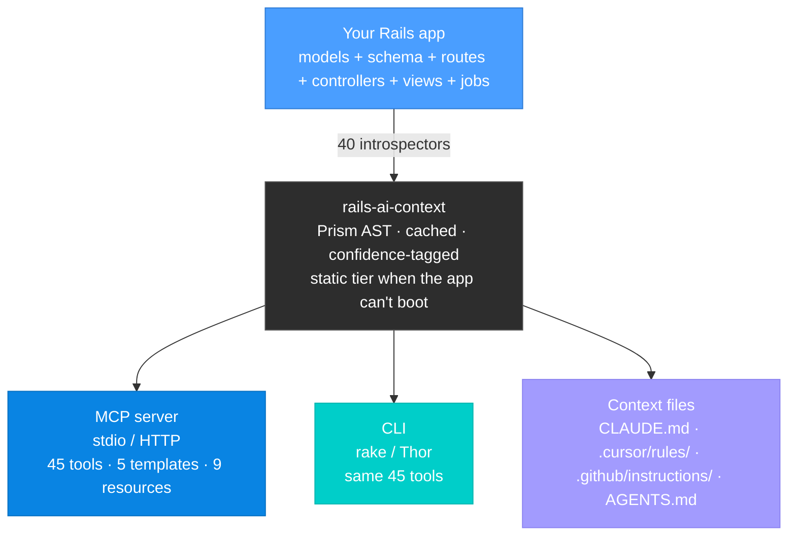

<div align="center">

# rails-ai-context

*Give your AI coding assistant ground truth about your Rails app*

[](https://rubygems.org/gems/rails-ai-context)
[](https://rubygems.org/gems/rails-ai-context)
[](https://github.com/crisnahine/rails-ai-context/actions)
[](https://registry.modelcontextprotocol.io)
[](https://github.com/crisnahine/rails-ai-context)
[](https://github.com/crisnahine/rails-ai-context)
[](LICENSE)

[](https://claude.ai/claude-code)
[](https://cursor.com)
[](https://github.com/features/copilot)
[](https://opencode.ai)
[](https://codex.openai.com)
[](docs/CLI.md)

:star: If this gem saves you a correction loop, star it on GitHub!

[Why](#why) • [Features](#features) • [Getting started](#getting-started) • [Usage](#usage) • [Tools](#tools) • [Configuration](#configuration) • [Documentation](#documentation)


</div>

**rails-ai-context** is a Ruby gem that turns your Rails app into the source of truth for AI coding assistants. Instead of guessing your schema, associations, routes and conventions from training data, the assistant asks your app: 45 read-only tools served over [MCP](https://modelcontextprotocol.io) or run from the CLI, plus generated context files for Claude Code, Cursor, GitHub Copilot, OpenCode and Codex CLI.

> [!TIP]
> Nothing to add to your Gemfile if you don't want to. `gem install rails-ai-context`, then `rails-ai-context init` inside any Rails app. It also works on an app that won't boot: pass `--no-boot` and every tool answers from the source files.

## Why

You have seen your assistant do these:

- Write a migration for a column that already exists.
- Call `user.posts` when the association is `user.articles`.
- Scaffold tests with FactoryBot in a fixture-based suite.
- Miss a `before_action` inherited from a parent controller, then wonder why auth fails.
- Add a gem you already have, or call an API from one you don't.
- Invent a method that isn't in the codebase.

You catch it, fix it, re-prompt, and something next to it breaks. The tokens are cheap; the correction loop is what costs you the afternoon. This gem removes the guess at the source.

| You ask the AI to... | Without | With |
|:---|:---|:---|
| Add a `subscription_tier` column to users | Writes the migration, duplicates an existing column | Reads the live schema, sees `subscription_status`, asks before migrating |
| Call `user.posts` in a controller | Guesses; `NoMethodError` at runtime | Resolves the real association from the model |
| Write tests for a new model | Scaffolds with FactoryBot | Detects your fixture-based suite and matches it |
| Fix a failing create action | Misses the inherited `authenticate_user!` | Gets parent-controller filters inline with the action source |
| Build a dashboard page | Invents Tailwind classes from memory | Gets your real button/card/alert patterns |
| Trace where `publishable?` is used | Reads 6 files in sequence, still misses callers | One call: definition + source + every caller + tests |

<div align="center">


</div>

## Features

- **45 read-only tools** for schema, models, controllers, routes, views, Stimulus, Turbo, jobs, services, mailers, i18n, gems, config, tests, security, performance and more. Every answer comes from your app.
- **Prism AST parsing** for model introspection. Each result carries `[VERIFIED]` or `[INFERRED]` so the assistant knows what is ground truth and what needs a runtime check.
- **Three ways in**: MCP over stdio, MCP mounted inside your Rails app over HTTP, or plain CLI in any terminal.
- **Generated context files** for Claude Code, Cursor, GitHub Copilot, OpenCode and Codex CLI, with the MCP config each tool auto-detects on project open.
- **Live resources**: `rails://` and `rails-ai-context://` URIs that introspect fresh on every read.
- **Anti-hallucination rules** shipped in every generated context file, on by default.
- **Static tier**: when the app can't boot, tools answer from `config/routes.rb`, `db/schema.rb`, migrations and source files, and say so.
- **Works with real app shapes**: packwerk packs, in-repo engines, multi-database schema dumps, Mongoid, API-only apps.
- **Custom tools**: register your own `MCP::Tool` classes next to the built-in ones and test them with the bundled `TestHelper`.

## Getting started

### Requirements

- Ruby 3.1 or newer
- Rails 7.0 or newer
- Optional: `brakeman` for `security_scan`, `listen` for `watch`, `ripgrep` for faster `search_code`

### Install in the Gemfile

```bash
bundle add rails-ai-context --group development
rails generate rails_ai_context:install
```

The generator asks which AI tools you use and whether you want MCP or CLI mode, then writes the context files, the MCP config for each tool, and `config/initializers/rails_ai_context.rb`. Re-running it is safe; it keeps what you have and adds what is missing.

### Install standalone

```bash
gem install rails-ai-context
cd your-rails-app
rails-ai-context init
rails-ai-context serve
```

No Gemfile change. Config lives in `.rails-ai-context.yml`. Works with rbenv, rvm, asdf, mise, chruby and system Ruby. See [Standalone](docs/STANDALONE.md).

### Check it works

```bash
rails ai:doctor                                  # in-Gemfile: readiness score + diagnostics
rails-ai-context doctor                          # standalone

rails 'ai:tool[schema]' table=users
rails 'ai:tool[model_details]' model=User
rails 'ai:tool[search_code]' pattern=publishable? match_type=trace
```

Then open the project in your AI tool. The MCP config it wrote is picked up on open, and the assistant starts calling `rails_get_model_details` instead of guessing.

> [!NOTE]
> The CLI commands above are for you. When MCP is connected the assistant calls the same tools itself; you never type them.

## Usage

### MCP over stdio

The default. Each AI tool gets its own config file (`.mcp.json`, `.cursor/mcp.json`, `.vscode/mcp.json`, `opencode.json`, `.codex/config.toml`) pointing at:

```bash
rails ai:serve             # in-Gemfile
rails-ai-context serve     # standalone
```

### MCP over HTTP

Mount the server inside your app. It inherits your routing, auth and middleware, and needs no second process.

```ruby
# config/routes.rb
mount RailsAiContext::Engine, at: "/mcp"
```

Point the client at `http://localhost:3000/mcp`. There is also a standalone HTTP process: `rails-ai-context serve --transport http --port 6029`.

> [!WARNING]
> Each connected client that opens the SSE channel holds one server thread for the life of the connection. Fine for development; raise Puma's thread count or use the standalone HTTP process if several clients share the app.

### CLI

Same 45 tools, no server, any terminal.

```bash
rails 'ai:tool[search_code]' pattern="publishable?" match_type=trace
rails-ai-context tool schema --table users --detail full
```

Tool names resolve loosely: `schema`, `get_schema` and `rails_get_schema` all work. Most tools take `detail=summary|standard|full`.

### Commands

| In-Gemfile | Standalone | What it does |
|:---|:---|:---|
| `rails ai:serve` | `rails-ai-context serve` | Start the MCP server (stdio) |
| `rails ai:serve_http` | `rails-ai-context serve --transport http` | Start the MCP server (HTTP) |
| `rails 'ai:tool[NAME]'` | `rails-ai-context tool NAME` | Run one tool |
| `rails ai:tool` | `rails-ai-context tool --list` | List the tools |
| `rails ai:context` | `rails-ai-context context` | Generate context files |
| `rails ai:doctor` | `rails-ai-context doctor` | Diagnostics and readiness score |
| `rails ai:watch` | `rails-ai-context watch` | Regenerate on file change |
| `rails 'ai:preset[NAME]'` | `rails-ai-context preset NAME` | Run a multi-tool preset (`architecture`, `debugging`, `migration`) |

Flags shared by the app-reading commands: `--app-path PATH` to target another directory, `--environment ENV` to set `RAILS_ENV`, and `--no-boot` to skip the boot attempt and answer from source. Full list in the [CLI reference](docs/CLI.md).

## Tools

Every tool is read-only and answers from your app.

| Category | Tools |
|:---|:---|
| Search and trace | `search_code`, `get_edit_context` |
| Understand | `analyze_feature`, `get_context`, `onboard` |
| Schema and models | `get_schema`, `get_model_details`, `get_callbacks`, `get_concern` |
| Controllers and routes | `get_controllers`, `get_routes` |
| Views and frontend | `get_view`, `get_stimulus`, `get_partial_interface`, `get_turbo_map`, `get_frontend_stack` |
| Testing and quality | `get_test_info`, `generate_test`, `validate`, `security_scan`, `performance_check` |
| App config and services | `get_api`, `get_conventions`, `get_config`, `get_gems`, `get_env`, `get_helper_methods`, `get_service_pattern`, `get_job_pattern`, `get_component_catalog`, `get_i18n`, `get_mailers`, `get_engines`, `get_autoload`, `get_active_support`, `get_env_config` |
| Data and debugging | `dependency_graph`, `migration_advisor`, `search_docs`, `query`, `read_logs`, `diagnose`, `review_changes`, `runtime_info`, `session_context` |

A few worth knowing on day one:

- `search_code` with `match_type=trace` returns definition, source, every caller grouped by type, and the tests, in one call. That replaces 4 to 5 file reads.
- `get_controllers` returns the action source with inherited filters, strong params and the render map.
- `get_model_details` returns associations, validations, scopes, enums and macros from the AST, each tagged `[VERIFIED]` or `[INFERRED]`.
- `query` runs read-only SQL with a timeout, a row limit and column redaction. `read_logs` redacts sensitive data before it leaves the process.

Parameters for all 45 are in the [tools reference](docs/TOOLS.md); worked examples in [recipes](docs/RECIPES.md).

### Live resources

MCP clients can also read structured data as resources. Templates introspect fresh on every request:

| URI | Returns |
|:---|:---|
| `rails://models/{name}` | Associations, validations, schema for one model |
| `rails-ai-context://controllers/{name}` | Actions, inherited filters, strong params |
| `rails-ai-context://controllers/{name}/{action}` | Action source with the filters that apply |
| `rails-ai-context://views/{path}` | View template content (path traversal blocked) |
| `rails-ai-context://routes/{controller}` | Live route map for one controller |

Plus 9 static resources: `rails://schema`, `routes`, `conventions`, `gems`, `controllers`, `config`, `tests`, `migrations`, `engines`.

## Anti-hallucination rules

Every generated context file (`CLAUDE.md`, `.cursor/rules/`, `.github/instructions/`, `AGENTS.md`) ships with six rules the assistant reads before writing code:

1. Verify before you write. Never reference a column, association, route, helper, method, class, partial or gem that a tool call in this turn did not confirm.
2. Mark every assumption with `[ASSUMPTION]`. "I'd need to check X first" is a good answer.
3. Training data describes average Rails. This app isn't average. When something feels obviously standard, query anyway.
4. Check the inheritance chain before every edit: inherited filters, concerns, includes, STI parents.
5. Empty tool output is information. "0 callers found" means investigate, it does not mean proceed.
6. Stale context lies. Re-query after writes.

On by default. Turn off with `config.anti_hallucination_rules = false` if you prefer your own.

## When the app can't boot

`rails-ai-context` tries a full boot for live reflection. When boot fails (missing ENV vars, an unreachable service, a broken initializer) the app-reading commands fall back to the static tier instead of dying: routes from `config/routes.rb`, schema from `db/schema.rb`, `db/structure.sql` or migrations, models and controllers from their source files. Every response carries a banner naming the degradation, static data is tagged `[STATIC]`, and sections that need a booted app report `[UNAVAILABLE]` with the reason.

`--no-boot` skips the attempt outright, which is fast and immune to boot-time side effects. `doctor` still needs a bootable app; diagnosing the boot is its job.

Code is found in the conventional layout, in packwerk packs (`packs/*/app/*`), in in-repo engines (`engines/*/app/*`), and in any `extra_app_paths` from `.rails-ai-context.yml`. Multi-database schema dumps (`db/queue_schema.rb` and friends) show up under a `Secondary databases` section. Mongoid apps get an `[UNAVAILABLE]` schema signal plus static model data instead of an empty table, and API-only apps get "not applicable" from the view and frontend tools instead of a silent blank. Details in [Compatibility](docs/COMPATIBILITY.md).

## Configuration

```ruby
# config/initializers/rails_ai_context.rb
if defined?(RailsAiContext)
  RailsAiContext.configure do |config|
    config.ai_tools  = %i[claude cursor]   # which AI tools to generate for
    config.tool_mode = :mcp                # :mcp (default) or :cli
    config.preset    = :full               # :full (40 introspectors) or :standard (17)
  end
end
```

Standalone installs use the same keys in `.rails-ai-context.yml`. All options with defaults are in [Configuration](docs/CONFIGURATION.md).

### Custom tools

Register your own tools next to the built-in ones:

```ruby
# app/mcp_tools/rails_get_business_metrics.rb
class RailsGetBusinessMetrics < MCP::Tool
  tool_name "rails_get_business_metrics"
  description "Key business metrics for this app"

  def call(period: "week")
    MCP::Tool::Response.new([{ type: "text", text: "Users this #{period}: #{User.recent.count}" }])
  end
end

# config/initializers/rails_ai_context.rb
config.custom_tools = ["RailsGetBusinessMetrics"]
```

Test them with the bundled helper (RSpec or Minitest):

```ruby
include RailsAiContext::TestHelper

response = execute_tool("business_metrics", period: "month")
assert_tool_response_includes(response, "Users")
```

See [Custom tools](docs/CUSTOM_TOOLS.md).

### Observability

Every MCP call fires an `ActiveSupport::Notifications` event:

```ruby
ActiveSupport::Notifications.subscribe("rails_ai_context.tools.call") do |event|
  ms = (event.payload[:duration].to_f * 1000).round
  Rails.logger.info "[MCP] #{event.payload[:tool_name]} #{ms}ms"
end
```

## How it works



Internals, the introspector list and the AST engine are in [Architecture](docs/ARCHITECTURE.md) and [Introspectors](docs/INTROSPECTORS.md).

## Documentation

| | |
|:---|:---|
| [Quickstart](docs/QUICKSTART.md) | Up and running in 5 minutes |
| [Guide](docs/GUIDE.md) | Every command, parameter and option |
| [Tools reference](docs/TOOLS.md) | All 45 tools with every parameter |
| [Recipes](docs/RECIPES.md) | Real workflows, end to end |
| [AI tool setup](docs/SETUP.md) | Claude Code, Cursor, Copilot, OpenCode, Codex CLI, HTTP transport |
| [CLI reference](docs/CLI.md) | Commands, flags and argument syntax |
| [Standalone](docs/STANDALONE.md) | Use without a Gemfile entry |
| [Configuration](docs/CONFIGURATION.md) | Every option with its default |
| [Custom tools](docs/CUSTOM_TOOLS.md) | Build and test your own tools |
| [Architecture](docs/ARCHITECTURE.md) | System design and internals |
| [Introspectors](docs/INTROSPECTORS.md) | All 40 introspectors and the AST engine |
| [Security](docs/SECURITY.md) | SQL safety layers and file blocking |
| [Compatibility](docs/COMPATIBILITY.md) | Supported versions, operating tiers, app shape matrix |
| [Troubleshooting](docs/TROUBLESHOOTING.md) | Common problems and fixes |
| [FAQ](docs/FAQ.md) | Frequently asked questions |

<div align="center">
<br>

Built by a Rails developer with 10+ years in production. If it saves you time, consider [sponsoring the project](https://github.com/sponsors/crisnahine).

</div>
