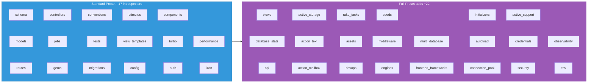

<div align="center" markdown="1">

# Introspectors

**39 modules that extract structured data from your Rails application.**

[Architecture](ARCHITECTURE.md) · [Configuration](CONFIGURATION.md) · [Tools Reference](TOOLS.md) · [Security](SECURITY.md)

</div>

---

## How introspectors work

Each introspector:

1. Examines a specific aspect of your Rails app (schema, models, routes, etc.)
2. Returns a Hash with structured data (never raises - wraps errors in `{ error: msg }`)
3. Results are cached with TTL + SHA256 fingerprint invalidation
4. Runs as part of a preset (`:standard` or `:full`) or can be configured individually

## Presets

### `:full` (default) - all 39 introspectors

Full AI context. Covers every aspect of your app.

### `:standard` - 17 introspectors

Lightweight subset for faster generation:

```
schema, models, routes, jobs, gems, conventions, controllers,
tests, migrations, stimulus, view_templates, config, components,
turbo, auth, performance, i18n
```

### Preset comparison



### Custom list

```ruby
RailsAiContext.configure do |config|
  config.introspectors = %i[schema models routes controllers views]
end
```

---

## All 39 introspectors

### Core

| Introspector | Key | What it extracts |
|:-------------|:----|:-----------------|
| SchemaIntrospector | `:schema` | Database tables, columns, types, indexes, defaults, encrypted hints |
| ModelIntrospector | `:models` | Associations, validations, scopes, enums, concerns (AST-based) |
| RouteIntrospector | `:routes` | Routes with helpers, HTTP methods, constraints |
| ControllerIntrospector | `:controllers` | Actions, filters, strong params, render paths |
| ViewIntrospector | `:views` | View files, layouts, partials |
| ViewTemplateIntrospector | `:view_templates` | Template content with ivars, Turbo frames, Stimulus refs |

### Models & Data

| Introspector | Key | What it extracts |
|:-------------|:----|:-----------------|
| MigrationIntrospector | `:migrations` | Migration files, versions, reversibility |
| SeedsIntrospector | `:seeds` | Seed file analysis |
| DatabaseStatsIntrospector | `:database_stats` | Table sizes, row counts, index stats |
| MultiDatabaseIntrospector | `:multi_database` | Multi-database configuration |

### Frontend

| Introspector | Key | What it extracts |
|:-------------|:----|:-----------------|
| StimulusIntrospector | `:stimulus` | Controllers, targets, values, actions |
| TurboIntrospector | `:turbo` | Turbo Frames, Streams, broadcasts |
| AssetPipelineIntrospector | `:assets` | Asset pipeline configuration, manifests |
| FrontendFrameworkIntrospector | `:frontend_frameworks` | React/Vue/Svelte/Angular detection |
| ComponentIntrospector | `:components` | ViewComponent/Phlex: props, slots, previews |

### Config & Infrastructure

| Introspector | Key | What it extracts |
|:-------------|:----|:-----------------|
| ConfigIntrospector | `:config` | Database, cache, queue, Action Cable config |
| GemIntrospector | `:gems` | Notable gems with versions and categories |
| ConventionIntrospector | `:conventions` | Auth patterns, flash messages, test patterns |
| I18nIntrospector | `:i18n` | Locale files, translation keys |
| MiddlewareIntrospector | `:middleware` | Rack middleware stack |
| EngineIntrospector | `:engines` | Mounted engines |
| DevopsIntrospector | `:devops` | Dockerfile, CI config, deployment |

### Jobs & Services

| Introspector | Key | What it extracts |
|:-------------|:----|:-----------------|
| JobIntrospector | `:jobs` | Background jobs: queue, retries, schedules |
| RakeTaskIntrospector | `:rake_tasks` | Custom rake tasks |

### Security & Auth

| Introspector | Key | What it extracts |
|:-------------|:----|:-----------------|
| AuthIntrospector | `:auth` | Authentication framework (Devise, etc.) |
| ApiIntrospector | `:api` | API configuration, versioning, serializers |

### Rails Features

| Introspector | Key | What it extracts |
|:-------------|:----|:-----------------|
| ActiveStorageIntrospector | `:active_storage` | Attachments, variants, services |
| ActionTextIntrospector | `:action_text` | Rich text attributes |
| ActionMailboxIntrospector | `:action_mailbox` | Mailbox routing rules |

### Analysis

| Introspector | Key | What it extracts |
|:-------------|:----|:-----------------|
| TestIntrospector | `:tests` | Test framework, file counts, coverage hints |
| PerformanceIntrospector | `:performance` | N+1 risks, missing indexes, counter_cache hints |

### Runtime & Framework Internals

These introspectors map directly onto [`RAILS_NERVOUS_SYSTEM.md`](../RAILS_NERVOUS_SYSTEM.md) sections and capture framework-level surface that `:config`, `:auth`, and `:middleware` don't.

| Introspector | Key | Nervous-system § | What it extracts |
|:-------------|:----|:---|:-----------------|
| InitializerIntrospector | `:initializers` | §2 | `Rails.application.initializers` graph: name, owner, `before:`/`after:` edges, block `source_location`, per-file `config/initializers/*.rb` summary |
| AutoloadIntrospector | `:autoload` | §3 | Zeitwerk presence, autoloaders (`:main` / `:once`) with collapsed + ignored dirs, `autoload_paths`, `eager_load_paths`, custom inflections (`acronym`, `plural`, `singular`, `irregular`) |
| ConnectionPoolIntrospector | `:connection_pool` | §10 | Per-database adapter config: pool size, `checkout_timeout`, `reaping_frequency`, `prepared_statements`, `advisory_locks`, replica flag, connection-handler roles, automatic shard selector detection |
| ActiveSupportIntrospector | `:active_support` | §17 | Concerns in `app/**/concerns/` (ActiveSupport::Concern flags, `included do`/`class_methods do` blocks), deprecators registry, MessageEncryptor/Verifier usage, TaggedLogging config, common on-load hooks, cache store options |
| CredentialsIntrospector | `:credentials` | §30 | Default + per-env encrypted files, master-key source (`env:RAILS_MASTER_KEY` vs `file:config/master.key` vs missing), `require_master_key` flag, arbitrary encrypted configs (`config/*.yml.enc`), top-level key **names only** (never values) |
| SecurityIntrospector | `:security` | §32 | `force_ssl`, SSL options (HSTS `expires`/`subdomains`/`preload`), `host_authorization` hosts, ContentSecurityPolicy directives + `report_only`, PermissionsPolicy directives, CSRF config (`protect_from_forgery`, `per_form_csrf_tokens`, `origin_check`), cookie session options, Rails 7.2+ `allow_browser` usage |
| ObservabilityIntrospector | `:observability` | §34 + §38 | `ActiveSupport::LogSubscriber.log_subscribers` catalog, AS::Notifications subscriber registry (pattern + count + sample class), `ActionDispatch::ServerTiming` middleware detection, Rails 8.1 `event_reporter` availability, log level + tags, canonical Rails event-name catalog (10 subsystems) |
| EnvIntrospector | `:env` | §36 | Catalog of 30+ Rails-related ENV vars partitioned into `set` / `unset`; safe vars (`RAILS_ENV`, `RAILS_MAX_THREADS`, etc.) return values, sensitive vars (`SECRET_KEY_BASE`, `DATABASE_URL`, `RAILS_MASTER_KEY`, etc.) return `redacted: true` only; scans `config/`/`app/`/`lib/` for app-specific `ENV["X"]` references |

---

## AST-based introspection

The **SourceIntrospector** uses Prism AST parsing for model analysis. It is infrastructure shared by the introspectors above rather than an introspector you can enable: there is no `:source` key for `config.introspectors`.

It runs a single-pass Dispatcher that walks the AST once and feeds events to all registered listeners simultaneously. Model analysis uses the seven below by default; the rest are used through targeted walks (schema dumps, migrations, Gemfiles, rake tasks, initializers, components, and so on).

### The 7 default Prism listeners

| Listener | What it detects |
|:---------|:---------------|
| AssociationsListener | `belongs_to`, `has_many`, `has_one`, `has_and_belongs_to_many` |
| ValidationsListener | `validates`, `validates_*_of`, custom `validate :method` |
| ScopesListener | `scope :name, -> { ... }` |
| EnumsListener | Rails 7+ and legacy enum syntax, prefix/suffix options |
| CallbacksListener | All AR callback types, `after_commit` with `on:` resolution |
| MacrosListener | `encrypts`, `normalizes`, `delegate`, `has_secure_password`, `serialize`, `store`, `has_one_attached`, `has_many_attached`, `has_rich_text`, `generates_token_for`, `attribute` |
| MethodsListener | `def`/`def self.`, visibility tracking, parameter extraction, `class << self` |

### The targeted-walk listeners

Passed to `SourceIntrospector.walk(path, key => Listener)` when a specific file needs reading. Several take arguments, so one class serves many callers.

| Listener | What it detects |
|:---------|:---------------|
| GenericMacroListener | Any receiver-less macro you name: `GenericMacroListener.new(:devise, :rate_limit)`. Returns args, values (with a source-slice fallback), options, option values and option nodes |
| ChainedCallListener | Calls on a receiver: `ChainedCallListener.new(:includes)`, or `receiver: :inflect` to pin the receiver. Reports the receiver name |
| ConfigAssignmentListener | `config.key = value` and `config.a.b = value` in initializers, plus bare `config.jwt do ... end` section references. Takes a root name (`:config` by default, e.g. `:DatabaseCleaner`) |
| ClassDefinitionListener | Class definitions with their superclass, namespaces resolved |
| ComponentStructureListener | ViewComponent and Phlex structure: `renders_one`/`renders_many`, slot methods, hash/array constant tables, `case @ivar` variant branching, `CONST[@ivar]` indexing |
| MiddlewareConfigListener | `config.middleware.use` / `insert_before` / `insert_after` |
| SchemaDslListener | `schema.rb`: `create_table`, `t.string`, `t.index`, `add_foreign_key`, `create_enum` |
| MigrationDslListener | Migration DSL: `create_table`, `add_column`, `add_index`, `add_reference`, and friends |
| RoutesDslListener | `config/routes.rb`, resolving namespace/scope/resources nesting into flat routes |
| MountListener | `mount Sidekiq::Web, at: "/sidekiq"` and the hash form |
| GemfileDslListener | `gem "name", "version"` and `group :development do ... end` |
| RakeTaskDslListener | `namespace`, `desc`, `task` in `.rake` files |
| EnvAccessListener | `ENV["KEY"]`, `ENV.fetch("KEY")`, `ENV.fetch("KEY", default)` |
| MongoidFieldsListener | Mongoid `field`, embedded relations, custom collection names |
| MailboxRoutingListener | Action Mailbox `routing` and processing callbacks |
| ModelReferenceListener | Model constants used in controllers: `Post.find`, `params.require(:post)`, ivar writes |
| VariantCallListener | `variant` calls (ChainedCallListener with `:variant` preset) |

### Adding a listener

1. Subclass `BaseListener` in `lib/rails_ai_context/introspectors/listeners/`. Use its helpers rather than re-reading nodes: `extract_symbol_args`, `extract_keyword_options`, `extract_arg_values` (source-slice fallback for expressions like `2.hours`), `extract_keyword_sources`, `extract_keyword_nodes`, `keyword_hash`, `constant_path_string`.
2. Implement the `on_*_node_enter` hooks you need and push plain hashes onto `@results`. Never return Prism nodes as the result itself; `option_nodes` is the one deliberate exception, for callers that must inspect an expression's shape.
3. Register the event in `SourceIntrospector.register_listener` if it is not already in the list (call, def, class, module, block, singleton class, case, constant write).
4. Add a spec of the same name under `spec/lib/rails_ai_context/introspectors/listeners/`.
5. Add a row to the table above.

### Choosing between AST and regex

Use the AST when the thing you want **is** a Ruby construct: a macro call and its arguments, a method definition, a class and its superclass, an assignment, a constant, a `case`. If you find yourself running a regex over text you already parsed, that is a parse of a parse. Fix it at the node.

Regex is the right tool, and stays, for:

- **Files that are not Ruby.** `Gemfile.lock`, YAML (`database.yml`, `sidekiq.yml`, fixtures), `structure.sql`, Dockerfiles, ERB, HAML, Slim, JavaScript.
- **Mixed-extension globs.** A view scan spanning ERB and Phlex `.rb` needs one matcher, or the two halves drift apart.
- **Vocabulary classification.** "Does this middleware body talk about auth?" is about words, not structure; no node carries it.
- **Anything the listeners cannot scope.** Tying a call to the enclosing action or `namespace` block needs block scope the listeners do not track, so those fall back to line scanning.

Every remaining regex over `.rb` content carries a one-line comment saying which of these it is. If you add one without a reason, convert it instead.

### Confidence tagging

Every AST result carries a confidence tag:

- **`[VERIFIED]`** - All arguments are static literals (strings, symbols, numbers). Ground truth.
- **`[INFERRED]`** - Arguments contain dynamic expressions (variables, method calls). Requires runtime verification.

```
has_many :posts                    → [VERIFIED]
has_many :posts, class_name: name  → [INFERRED]  (name is a variable)
```

### AstCache

Thread-safe parse cache using `Concurrent::Map`:

- Keyed by: file path + SHA256 content hash + mtime
- Invalidates automatically when file changes
- Shared by all AST-based introspectors
- Cleared on `reset_all_caches!` (triggered by live reload)

---

## Cache invalidation

Introspection results are cached at two levels:

1. **Introspection cache** - Full context hash, invalidated by TTL (`config.cache_ttl`, default: 60s) and fingerprint change
2. **AST cache** - Per-file parse results, invalidated by file content change (SHA256)

The **Fingerprinter** computes a composite SHA256 from all watched directories (`app/`, `config/`, `db/`, `lib/tasks/`, `Gemfile.lock`). When the fingerprint changes, the introspection cache is invalidated even if TTL hasn't expired.

**Live Reload** watches these directories and calls `reset_all_caches!` when changes are detected, then notifies connected MCP clients via `notify_resources_list_changed`.

---

<div align="center" markdown="1">

**[← Architecture](ARCHITECTURE.md)** · **[Security →](SECURITY.md)**

[Back to Home](index.md)

</div>
