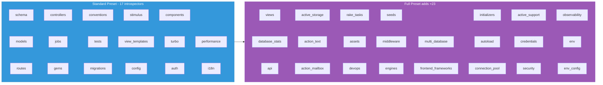

<div align="center" markdown="1">

# Introspectors

**40 modules that extract structured data from your Rails application.**

[Architecture](ARCHITECTURE.md) · [Configuration](CONFIGURATION.md) · [Tools Reference](TOOLS.md) · [Security](SECURITY.md)

</div>

---

## How introspectors work

Each introspector:

1. Subclasses `Introspectors::Base`, taking the `app` handle
2. Examines a specific aspect of your Rails app (schema, models, routes, etc.)
3. Returns a Hash with structured data, and raises on failure: `Introspector#call` turns a raised section into `{ error: msg }` and logs a warning
4. Results are cached with TTL + SHA256 fingerprint invalidation
5. Runs as part of a preset (`:standard` or `:full`) or can be configured individually

## Presets

### `:full` (default) - all 40 introspectors

Full AI context. Covers every aspect of your app.

### `:standard` - 17 introspectors

Lightweight subset for faster generation:

```
schema, models, routes, jobs, gems, conventions, controllers,
tests, migrations, stimulus, view_templates, config, components,
turbo, auth, performance, i18n
```

### Preset comparison


```mermaid
graph LR
    subgraph standard["Standard Preset - 17 introspectors"]
        direction TB
        S1["schema"] ~~~ S2["models"] ~~~ S3["routes"]
        S4["controllers"] ~~~ S5["jobs"] ~~~ S6["gems"]
        S7["conventions"] ~~~ S8["tests"] ~~~ S9["migrations"]
        S10["stimulus"] ~~~ S11["view_templates"] ~~~ S12["config"]
        S13["components"] ~~~ S14["turbo"] ~~~ S15["auth"]
        S16["performance"] ~~~ S17["i18n"]
    end

    subgraph full_only["Full Preset adds +23"]
        direction TB
        F1["views"] ~~~ F2["database_stats"] ~~~ F3["api"]
        F4["active_storage"] ~~~ F5["action_text"] ~~~ F6["action_mailbox"]
        F7["rake_tasks"] ~~~ F8["assets"] ~~~ F9["devops"]
        F10["seeds"] ~~~ F11["middleware"] ~~~ F12["engines"]
        F13["multi_database"] ~~~ F14["frontend_frameworks"]
        F15["initializers"] ~~~ F16["autoload"] ~~~ F17["connection_pool"]
        F18["active_support"] ~~~ F19["credentials"] ~~~ F20["security"]
        F21["observability"] ~~~ F22["env"] ~~~ F23["env_config"]
    end

    standard --> full_only

    style standard fill:#3498db,stroke:#2980b9,color:#fff
    style full_only fill:#9b59b6,stroke:#8e44ad,color:#fff
```

### Custom list

```ruby
RailsAiContext.configure do |config|
  config.introspectors = %i[schema models routes controllers views]
end
```

---

## All 40 introspectors

### Core

| Introspector | Key | What it extracts |
|:-------------|:----|:-----------------|
| SchemaIntrospector | `:schema` | Database tables, columns, types, indexes, defaults, encrypted hints |
| ModelIntrospector | `:models` | Associations, validations, scopes, enums, concerns (AST-based). Both tiers merge what the included concerns declare, tagged `from_concern:`; a concern whose file could not be read is listed in `concerns_unread`, a base class whose file could not be read in `bases_unread`, and the number of concerns `excluded_concerns` hid in `concerns_hidden` |
| RouteIntrospector | `:routes` | Routes with helpers, HTTP methods, constraints |
| ControllerIntrospector | `:controllers` | Actions, filters, strong params, render paths |
| ViewIntrospector | `:views` | View files, layouts, partials |
| ViewTemplateIntrospector | `:view_templates` | Template content with ivars, Turbo frames, Stimulus refs |

### Models & Data

| Introspector | Key | What it extracts |
|:-------------|:----|:-----------------|
| MigrationIntrospector | `:migrations` | Migration files, versions, reversibility. `recent` and `pending` entries are `{ version:, name: }`, and the name is the migration class (`CreatePosts`) in both tiers |
| SeedsIntrospector | `:seeds` | Seed file analysis |
| DatabaseStatsIntrospector | `:database_stats` | Table sizes, row counts, index stats |
| MultiDatabaseIntrospector | `:multi_database` | Multi-database configuration |

### Frontend

| Introspector | Key | What it extracts |
|:-------------|:----|:-----------------|
| StimulusIntrospector | `:stimulus` | Controllers, targets, values, actions |
| TurboIntrospector | `:turbo` | Turbo wiring with each entry's file and line: `turbo_frames`, `model_broadcasts`, `explicit_broadcasts`, `stream_subscriptions` |
| AssetPipelineIntrospector | `:assets` | Asset pipeline configuration, manifests |
| FrontendFrameworkIntrospector | `:frontend_frameworks` | React/Vue/Svelte/Angular detection |
| ComponentIntrospector | `:components` | ViewComponent/Phlex: props, slots, previews |

### Config & Infrastructure

| Introspector | Key | What it extracts |
|:-------------|:----|:-----------------|
| ConfigIntrospector | `:config` | Database, cache, queue, Action Cable config |
| GemIntrospector | `:gems` | Notable gems with versions and categories |
| ConventionIntrospector | `:conventions` | Auth patterns, flash messages, test patterns |
| I18nIntrospector | `:i18n` | Locale files, translation keys |
| MiddlewareIntrospector | `:middleware` | Rack middleware stack. The static tier declares an alternate source rather than an empty stack: without a booted app it answers only the file facts it can read |
| EngineIntrospector | `:engines` | Mounted engines |
| EnvConfigIntrospector | `:env_config` | Per-environment config files: notable toggles (`force_ssl`, `eager_load`, caching, queue adapter), assigned config keys |
| DevopsIntrospector | `:devops` | Dockerfile, CI config, deployment |

### Jobs & Services

| Introspector | Key | What it extracts |
|:-------------|:----|:-----------------|
| JobIntrospector | `:jobs` | Background jobs and Sidekiq workers, read from `app/jobs`, `app/workers` and `app/sidekiq`, and mailers (anywhere under `app/`, by parent chain): queue, retries, `sidekiq_options`, any `sidekiq_throttle`, schedules, and the `file:` each one is defined in |
| RakeTaskIntrospector | `:rake_tasks` | Custom rake tasks from the Rakefile, lib/tasks and rakelib |

### Security & Auth

| Introspector | Key | What it extracts |
|:-------------|:----|:-----------------|
| AuthIntrospector | `:auth` | Authentication framework (Devise, etc.) |
| ApiIntrospector | `:api` | API configuration, versioning, serializers |

### Rails Features

| Introspector | Key | What it extracts |
|:-------------|:----|:-----------------|
| ActiveStorageIntrospector | `:active_storage` | Attachments, variants, services |
| ActionTextIntrospector | `:action_text` | Rich text attributes |
| ActionMailboxIntrospector | `:action_mailbox` | Mailbox routing rules |

### Analysis

| Introspector | Key | What it extracts |
|:-------------|:----|:-----------------|
| TestIntrospector | `:tests` | Test framework, file counts, coverage hints |
| PerformanceIntrospector | `:performance` | N+1 risks, missing indexes, counter_cache hints |

### Runtime & Framework Internals

These introspectors map directly onto the internal RAILS_NERVOUS_SYSTEM checklist sections and capture framework-level surface that `:config`, `:auth`, and `:middleware` don't.

| Introspector | Key | Nervous-system § | What it extracts |
|:-------------|:----|:---|:-----------------|
| InitializerIntrospector | `:initializers` | §2 | `Rails.application.initializers` graph: name, owner, `before:`/`after:` edges, block `source_location`, per-file `config/initializers/*.rb` summary |
| AutoloadIntrospector | `:autoload` | §3 | Zeitwerk presence, autoloaders (`:main` / `:once`) with collapsed + ignored dirs, `autoload_paths`, `eager_load_paths`, custom inflections (`acronym`, `plural`, `singular`, `irregular`) |
| ConnectionPoolIntrospector | `:connection_pool` | §10 | Per-database adapter config: pool size, `checkout_timeout`, `reaping_frequency`, `prepared_statements`, `advisory_locks`, replica flag, connection-handler roles, automatic shard selector detection |
| ActiveSupportIntrospector | `:active_support` | §17 | Concerns in `app/**/concerns/` (ActiveSupport::Concern flags, `included do`/`class_methods do` blocks), deprecators registry, MessageEncryptor/Verifier usage, TaggedLogging config, common on-load hooks, cache store options |
| CredentialsIntrospector | `:credentials` | §30 | Default + per-env encrypted files, master-key source (`env:RAILS_MASTER_KEY` vs `file:config/master.key` vs missing), `require_master_key` flag, arbitrary encrypted configs (`config/*.yml.enc`), top-level key **names only** (never values) |
| SecurityIntrospector | `:security` | §32 | `force_ssl`, SSL options (HSTS `expires`/`subdomains`/`preload`), `host_authorization` hosts, ContentSecurityPolicy directives + `report_only`, PermissionsPolicy directives, CSRF config (`protect_from_forgery`, `per_form_csrf_tokens`, `origin_check`), cookie session options, Rails 7.2+ `allow_browser` usage |
| ObservabilityIntrospector | `:observability` | §34 + §38 | `ActiveSupport::LogSubscriber.log_subscribers` catalog, AS::Notifications subscriber registry (pattern + count + sample class), `ActionDispatch::ServerTiming` middleware detection, Rails 8.1 `event_reporter` availability, log level + tags, canonical Rails event-name catalog (10 subsystems) |
| EnvIntrospector | `:env` | §36 | Catalog of 30+ Rails-related ENV vars partitioned into `set` / `unset`; safe vars (`RAILS_ENV`, `RAILS_MAX_THREADS`, etc.) return values, sensitive vars (`SECRET_KEY_BASE`, `DATABASE_URL`, `RAILS_MASTER_KEY`, etc.) return `redacted: true` only; scans `config/`/`app/`/`lib/` for app-specific `ENV["X"]` references |

---

## AST-based introspection

The **SourceIntrospector** uses Prism AST parsing for model analysis. It is infrastructure shared by the introspectors above rather than an introspector you can enable: there is no `:source` key for `config.introspectors`.

It runs a single-pass Dispatcher that walks the AST once and feeds events to all registered listeners simultaneously. Model analysis uses the eight below by default; the rest are used through targeted walks (schema dumps, migrations, Gemfiles, rake tasks, initializers, components, and so on).

### The 8 default Prism listeners

| Listener | What it detects |
|:---------|:---------------|
| AssociationsListener | `belongs_to`, `has_many`, `has_one`, `has_and_belongs_to_many`, the polymorphic `belongs_to` of `delegated_type`, the `belongs_to` of `acts_as_tenant` (tenant defaults to `:account`), under the options of an enclosing `with_options` block |
| ValidationsListener | `validates`, `validates_*_of`, custom `validate :method`, under the options of an enclosing `with_options` block |
| ScopesListener | `scope :name, -> { ... }`, `lambda { ... }` and the block form |
| EnumsListener | Rails 7+ and legacy enum syntax, prefix/suffix options |
| CallbacksListener | All AR callback types including `around_*`, `after_touch`, `after_initialize` and `after_find`; `after_commit` with `on:` resolution; a callback object by its constant, a block as `[inline_block]`; `if:`/`unless:` kept as the source wrote them, and the options of an enclosing `with_options` block |
| MacrosListener | (each attribute macro and `has_secure_password` with its keyword options as written, under `written`) `encrypts`, `normalizes`, `delegate`, `has_secure_password`, `serialize`, `store`, `has_one_attached`, `has_many_attached`, `has_rich_text`, `generates_token_for`, `attribute`, `alias_attribute`, `store_accessor`, `self.ignored_columns`, `has_secure_token`, `accepts_nested_attributes_for`, `attr_readonly`, `query_constraints`, the class settings `self.inheritance_column`/`store_full_sti_class`/`strict_loading_by_default`/`implicit_order_column`/`locking_column =` as written, an `aasm` block's states, initial state, events and transitions, and model gems' class macros (`GEM_MACROS`: `has_paper_trail`, `friendly_id`, `mount_uploader`, `monetize`, `pg_search_scope`, `acts_as_list` and others) as written, without their block |
| MethodsListener | `def`/`def self.`, visibility tracking, parameter extraction, `class << self`, the methods `delegate` and Forwardable's `def_delegators`/`def_delegator` define (public unless `private: true`, and with no `end_location`, since a delegation has no body), and the methods `alias`, `alias_method`, `attr_*`, `define_method` with a literal name, `class_attribute` and `cattr_*`/`mattr_*` define (an alias keeps its original's visibility and parameters; Active Support's accessors are public on the class and, unless an option turns them off, on instances); each `def` carries `offset`/`end_offset`, which `SourceIntrospector.outside_defs` pairs against a call's `offset` to tell a call on the same line as a def from one inside it; `include_initialize: true` adds the constructor a caller reports on its own |
| MixinsListener | `include`, `prepend`, `extend`, `singleton_class.include` and `singleton_class.prepend` (`singleton_class.extend` is not read), flagging the ones that reach the ancestor chain, as reflection reports them |

### The targeted-walk listeners

Passed to `SourceIntrospector.walk(path, key => Listener)` when a specific file needs reading. Several take arguments, so one class serves many callers.

| Listener | What it detects |
|:---------|:---------------|
| GenericMacroListener | Any receiver-less macro you name: `GenericMacroListener.new(:devise, :rate_limit)`. Returns args, values (with a source-slice fallback), options, option values and option nodes, `proc_lines` (the line each block or lambda argument opens on, as `Proc#source_location` gives it), plus the nesting: `parent_offset` is the offset of the target macro call whose block this one sits in, paired against each call's own `offset` rather than its line |
| ChainedCallListener | Calls on a receiver: `ChainedCallListener.new(:includes)`, or `receiver: :inflect` to pin the receiver. Reports the receiver name |
| ConfigAssignmentListener | `config.key = value` and `config.a.b = value` in initializers and `config/environments/*.rb`, plus bare `config.jwt do ... end` section references and settings written without `=` (`<<`, a call with arguments, `+=`/`||=`/`&&=`, a block), tagged `write:`. Takes a root name (`:config` by default, e.g. `:DatabaseCleaner`) |
| ClassDefinitionListener | Class definitions with their superclass and the nesting a bare superclass is read in |
| ComponentStructureListener | ViewComponent and Phlex structure: `renders_one`/`renders_many`, slot methods, hash/array constant tables, `case @ivar` variant branching, `CONST[@ivar]` indexing |
| MiddlewareConfigListener | The app's own stack, reached through its config (`config.middleware`, `Rails.configuration.middleware`, `app.config.middleware`), through the app (`Rails.application.middleware`, `app.middleware`) or through the app's own application class (`MyApp::Application.config.middleware`, given as `app_class:`), never another rack stack: any other constant anywhere in the chain (`MyEngine.config.middleware`, `GoodJob::Engine.middleware`) is an engine's. Reads `use`, `insert`, `insert_before`, `insert_after`, `unshift`, `swap`, `move_before`, `move_after`, `delete`, and `config.exceptions_app =` as its own `exceptions_app` action |
| RouteFilesListener | The route files `config/application.rb` puts in `config.paths["config/routes.rb"]`: an assignment (a list, `.map`ped or not), `<<`/`push`/`concat`, `unshift`/`prepend`, `Rails.root.join` and literal `Dir[...]` globs, each as `set`/`append`/`prepend`. A list the app computes is recorded as `computed` |
| AutoloadPathsListener | Autoload roots `config/application.rb` adds by hand: `autoload_paths`/`eager_load_paths`/`autoload_once_paths` appends, `autoload_lib`, and `config.paths.add` with `eager_load:`. Literal paths under the app root only |
| AutoloadIgnoreListener | The lib subdirectories `autoload_lib(ignore:)` and `autoload_lib_once(ignore:)` keep out of autoloading, as `lib/<name>`. Literal strings and symbols only |
| PreviewPathsListener | ViewComponent preview directories the config sets: `view_component.previews.paths`, `preview_paths`, `preview_path`, in the same literal forms as AutoloadPathsListener |
| I18nLoadPathListener | Locale files `config.i18n.load_path` or `I18n.load_path` adds: `+=`, `<<`, `push`, `append`, `concat`, with `Dir[]`/`Dir.glob` around the same literal forms as AutoloadPathsListener |
| FixturePathsListener | Fixture directories a test helper sets: `fixture_paths =`/`<<`/`+=`/`push` and the older `fixture_path =`, on `self`, `config` or no receiver, in the same literal forms as AutoloadPathsListener |
| ViewPathsListener | View roots `config/application.rb` adds to `config.paths["app/views"]`: `unshift` puts one before app/views, `<<`/`push`/`concat` after it, in the same literal forms as AutoloadPathsListener |
| NamespacedRootsListener | Roots `config/application.rb` or an initializer hands Zeitwerk under a namespace: `push_dir(path, namespace: Const)`, as phlex:install writes, in the same literal forms as AutoloadPathsListener |
| SchemaDslListener | `schema.rb`: `create_table`, `t.string`, `t.column`, `t.index`, `add_foreign_key`, `create_enum`, `create_view`, `create_virtual_table`, and the comment the dumper writes for a table it could not describe |
| MigrationDslListener | Migration DSL: `create_table`, `add_column`, `add_index`, `add_reference`, and friends |
| MigrationReplayListener | What a replay needs beside the DSL: `def down`, `down`/`revert` blocks, and `t.timestamps` |
| RoutesDslListener | `config/routes.rb`, resolving namespace/scope/resources nesting into flat routes (a `controller:` with a leading slash is absolute, as in Rails); routing concerns (`concern` definitions replayed at each `concerns:` site), `with_options` defaults merged under each inner call, `match ... via:` (or the `via:` of an enclosing `scope`) as one route answering each verb it names (`GET|POST`, and `ANY` for `via: :all`, as the booted table has it), the controller a `scope(controller:)` or a route's own `controller:` names (with Rails' `a/b` shorthand when no action is given), and the `as:`, `param:`, `module:`, `path:` and `only:`/`except:` options. A block drawn through an app class (`ApiRouteSet::V1.draw(self) do`) takes the path and `as:` prefixes that class's `self.prefix` and `mapper_prefix` return as literals, or a literal prefix argument; a class whose prefix is not a literal, and that class's own `resources`, are counted as unexpanded. Routes drawn into an engine's table (`Spree::Core::Engine.routes.draw`) sit under the engine's namespace and carry `engine:`, which the route introspector files under that engine's mount, apart from the app's count. A file pulled in by `draw` is walked inside the scope its `draw` sits in, once per scope that draws it, so `draw :api` under `namespace :api` and `scope module: :v1` routes to `api/v1/...` at `/api/...` |
| MountListener | `mount Sidekiq::Web, at: "/sidekiq"`, the hash form, and a Rack app attached with `match "/metrics", to: MetricsApp` - `mount` is that call with a name derived. Paths carry the enclosing `namespace`/`scope` prefix; a scope whose own name is an expression yields no path rather than an unprefixed one, and `scope path: nil` adds no segment. A mounted app built by a call on a constant (`Flipper::UI.app(Flipper)`) is named by that call, arguments off |
| GemfileDslListener | `gem "name", "version"` and `group :development do ... end` |
| RakeTaskDslListener | `namespace` (with the span its block covers), `desc`, `task`, `multitask` in `.rake` files |
| EnvAccessListener | `ENV["KEY"]`, `ENV.fetch("KEY")`, `ENV.fetch("KEY", default)` |
| MailboxRoutingListener | Action Mailbox `routing` and processing callbacks |
| ModelReferenceListener | Model constants used in controllers: `Post.find`, `params.require(:post)`, ivar writes |
| VariantCallListener | `variant` calls (ChainedCallListener with `:variant` preset) |
| ProcLiteralListener | Proc literals: line, source, assigned constant |
| QueueAssignmentListener | A queue a class body assigns outside any method: Resque's `@queue = :name` and Que's `self.queue = "name"`, a literal as its value, anything else as source |
| MethodCallListener | Call sites by name or pattern anywhere in a file, inside a `def`, a lambda or a block included, with arguments, options, receiver, line and offset. Used by the Turbo introspector for broadcast calls and by `ActionFilters` for the skip macros |

`GenericMacroListener.new(*names, block_source: [:name])` adds `block`, the
one-line source of the block those macros are given. ProcLiteralListener is
what the job introspector reads a `queue_as` Proc with.

### Adding a listener

1. Subclass `BaseListener` in `lib/rails_ai_context/introspectors/listeners/`. Use its helpers rather than re-reading nodes: `extract_symbol_args`, `extract_keyword_options`, `extract_arg_values` (source-slice fallback for expressions like `2.hours`), `extract_keyword_sources`, `extract_keyword_nodes`, `keyword_hash`, `constant_path_string`.
2. Implement the `on_*_node_enter` hooks you need and push plain hashes onto `@results`. Never return Prism nodes as the result itself; `option_nodes` is the one deliberate exception, for callers that must inspect an expression's shape.
3. Nothing to register. `ListenerRegistration` reads the events off the `on_*` methods you defined, inherited ones included, and raises if one names an event prism never dispatches.
4. Add a spec of the same name under `spec/lib/rails_ai_context/introspectors/listeners/`.
5. Add a row to the table above.

### Choosing between AST and regex

Use the AST when the thing you want **is** a Ruby construct: a macro call and its arguments, a method definition, a class and its superclass, an assignment, a constant, a `case`. If you find yourself running a regex over text you already parsed, that is a parse of a parse. Fix it at the node.

Regex is the right tool, and stays, for:

- **Files that are not Ruby.** `Gemfile.lock`, YAML (`database.yml`, `sidekiq.yml`, fixtures), `structure.sql`, Dockerfiles, ERB, HAML, Slim, JavaScript.
- **Mixed-extension globs.** A view scan spanning ERB and Phlex `.rb` needs one matcher, or the two halves drift apart.
- **Vocabulary classification.** "Does this middleware body talk about auth?" is about words, not structure; no node carries it.
- **A prefilter before the parse.** Parsing every `.rb` under `app/` to find the handful that declare something costs more than a line match that ends the read; the AST still decides, on the files the match keeps.
- **Anything the listeners cannot scope.** Tying a call to the enclosing action or `namespace` block needs block scope the listeners do not track, so those fall back to line scanning.

Every remaining regex over `.rb` content carries a one-line comment saying which of these it is. If you add one without a reason, convert it instead.

### Readers built on the listeners

Some questions take more than one walk to answer, and the answer has to be the
same wherever it is asked. Those live as their own modules under
`Introspectors/`, and a tool calls one rather than repeating the walk:

| Module | What it answers |
|:-------|:---------------|
| `DeclaredConstant` | The constant a source file calls its own class, against the one its path camelizes to |
| `ActionPresence` | Whether a controller has an action: the public methods and `define_method` names of the controller, its ancestors up to Rails' base and the modules they include, the templates at each ancestor's view prefix, and the ancestors or modules no app source holds, which leave a missing action unverified. `rails_validate` and `rails_generate_test` both ask it |
| `ControllerSettings` | The layout a controller renders in (declared on it or an ancestor, else the `layouts/<controller_path>` file Rails finds by name, walking up the chain) and the `allow_browser`, `protect_from_forgery`, `add_flash_types`, `default_form_builder` and `wrap_parameters` calls it and its ancestors make. `rails_get_controllers` and `rails_get_view` both ask it |
| `TableName` | The table a model reads, from its own declarations |
| `HabtmJoinTables` | The join tables every `has_and_belongs_to_many` under the app's code and lib names, lib patches and engines included, for the schema's model-less table warning |
| `SuperclassChain` | What a class inherits from, followed through the app's own sources: the chain from a file's class up to a named base, and the constant-to-source lookup over the app's autoload roots that walks it |
| `CallSiteExpansion` | What one call of a mixin's macro-declaring method declares. `attachable :receipt, has_one: true` runs `def attachable(name, opts = {})`, whose body declares `has_one name` or `has_many name` by `opts[:has_one]`: the parameters bind to the call's literal arguments, and a branch (`if`, `unless`, `case`) the literals decide is taken alone. Where they cannot decide, what every way through declares alike is listed once; the rest, a lone `if`'s body included, comes back under `:conditional` with its condition and is not counted. A block the method evaluates on another receiver (`other.instance_eval`) comes back under `:foreign`, named with the receiver and any condition it runs under |
| `Includers` | Which classes and modules mix a module in, by `include`, `prepend` or `extend`: a written name resolves from the includer's namespace outward, and the nearest module the app declares decides. `rails_get_concern`'s "Included by", the service listing and the HABTM join-table owners all ask it |
| `RetryPolicy` | What a job does when it raises, as a reader would write it: the macro, its exceptions, then `attempts:` and `wait:` whatever order the source put them in |
| `SourceCalls` | Which other classes a file hands work to, off the call nodes: the verb list, the framework receivers left out, and the call or the class alone |
| `ServiceClasses` | Which classes under `app/services` are services and which are only the base of one, for the tool's listing and the generated files' line alike |
| `EnvReferences` | Every ENV name the app's source reads, file by file, for `rails_get_env` and the context file's `env` section alike: `app`, `config` and `lib` Ruby, ERB and config YAML, with config YAML on `sensitive_patterns` read for the names in its ERB tags only |
| `GemfileGems` | The one Gemfile read, off `GemfileDslListener`: its entries with options and groups (the gems section's local gems and groups) and the gem names (every other asker), so a commented-out `gem` line is no gem anywhere |
| `ModuleAliases` | Which app file a bare JS import specifier names: tsconfig/jsconfig `compilerOptions.paths` followed through `extends` (relative files and installed packages), and a vite/webpack/rspack `resolve.alias` written as a literal object. The Stimulus scan uses it to tie a registration or a base class to the controller file it imports |
| `HelperNames` | The helper methods a view can call: every method the app's helper modules define in every code root, and those of a module they `include`, found through the app's autoload roots (`lib` among them) or in its enclosing namespace's file (`CanonicalURL::Helpers` in `canonical_url.rb`). `rails_get_partial_interface` uses it so a helper call is not read as a local |
| `Interaction` | Whether a class runs as an ActiveInteraction, following its superclass chain through the app's own sources, and the filters it takes - inherited ones first, one per name, each carrying the filters nested inside its block. See the **Interaction filter** entry in `CONTEXT.md` |

### Confidence tagging

Every AST result carries a confidence tag:

- **`[VERIFIED]`** - All arguments are static literals (strings, symbols, numbers). Ground truth.
- **`[INFERRED]`** - Arguments contain dynamic expressions (variables, method calls). Requires runtime verification.

```
has_many :posts                    → [VERIFIED]
has_many :posts, class_name: name  → [INFERRED]  (name is a variable)
```

### AstCache

Thread-safe parse cache using `Concurrent::Map`:

- Keyed by: file path + SHA256 content hash + mtime, so a changed file is parsed again
- A file whose stat (mtime, size, inode) matches the last read answers without reading or hashing it, but only once that file was already two seconds older than the read, so a same-size rewrite within one mtime tick is still read
- Bounded at 500 parses; a recorded stat is dropped with its parse
- Shared by all AST-based introspectors
- Cleared on `reset_all_caches!` (triggered by live reload)

### RunCache

Answers kept for one introspection run and dropped when it ends: the file list for a source kind, each file's stat, the directories a kind lives in, concern directories and listings. A section asking again inside the run gets the first answer; the next run, and any tool called after it, asks the filesystem again.

---

## Cache invalidation

Introspection results are cached at three levels:

1. **Introspection cache** - Full context hash, invalidated by TTL (`config.cache_ttl`, default: 60s) and fingerprint change
2. **AST cache** - Per-file parse results, invalidated by file content change (SHA256), with a stat shortcut for a file older than the read
3. **Run cache** - File lists, stats and directory answers for one introspection run, dropped when it ends

The **Fingerprinter** computes a composite SHA256 from all watched directories (`app/`, `config/`, `db/`, `lib/tasks/`, `Gemfile.lock`). When the fingerprint changes, the introspection cache is invalidated even if TTL hasn't expired.

**Live Reload** watches these directories and calls `reset_all_caches!` when changes are detected, then notifies connected MCP clients via `notify_resources_list_changed`.

---

<div align="center" markdown="1">

**[← Architecture](ARCHITECTURE.md)** · **[Security →](SECURITY.md)**

[Back to Home](index.md)

</div>
