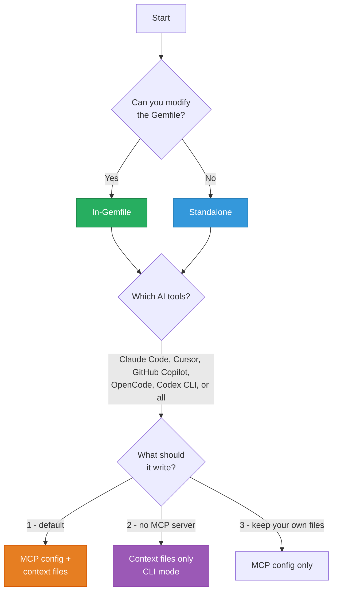

<div align="center" markdown="1">

# AI Tool Setup

**Per-editor setup for Claude Code, Cursor, Copilot, OpenCode, and Codex CLI.**

[Quickstart](QUICKSTART.md) · [Configuration](CONFIGURATION.md) · [Standalone](STANDALONE.md) · [Troubleshooting](TROUBLESHOOTING.md)

</div>

---

## Table of Contents

- [Which path is right for you?](#which-path-is-right-for-you)
- [Claude Code](#claude-code)
- [Cursor](#cursor)
- [GitHub Copilot](#github-copilot)
- [OpenCode](#opencode)
- [Codex CLI](#codex-cli)
- [A folder of apps](#a-folder-of-apps)
- [Verify MCP is connected](#verify-mcp-is-connected)
- [HTTP Transport](#http-transport-alternative)
- [Regenerating context files](#regenerating-context-files)

---

## Which path is right for you?



## Claude Code

### Auto-setup (recommended)

```bash
rails generate rails_ai_context:install  # Select "Claude Code"
```

This creates:
- `.mcp.json` - MCP auto-discovery config (auto-detected on project open)
- `CLAUDE.md` - Root context file
- `.claude/rules/rails-schema.md` - Schema rules (loaded when editing the schema dump or `db/migrate/` files)
- `.claude/rules/rails-models.md` - Model rules (loaded when editing `app/models/`)
- `.claude/rules/rails-context.md` - General context rules (always loaded)
- `.claude/rules/rails-mcp-tools.md` - Tool reference (always loaded)
- `.claude/rules/rails-components.md` - Component rules (loaded when editing `app/components/` or `app/views/components/`, written only when the app has view components)

Keeping your own `CLAUDE.md`? Add `--mcp-only` and only `.mcp.json` is
written; every context file is left alone. See
[CONFIGURATION.md](CONFIGURATION.md#mcp-only).

### Manual MCP config

If you need to configure manually, create `.mcp.json`:

```json
{
  "mcpServers": {
    "rails-ai-context": {
      "command": "bundle",
      "args": ["exec", "rails-ai-context", "serve"]
    }
  }
}
```

This is what the generator writes for an in-Gemfile install. A standalone install has no `bundle exec`: the command is `rails-ai-context` and the args are `["serve"]`. The same goes for the other tools below.

### Split rules with `paths:` frontmatter

Claude Code loads `.claude/rules/` files conditionally based on YAML frontmatter:

```yaml
---
paths:
  - "app/models/**/*.rb"
---
```

Schema, model and component rules use this to only load when relevant files are being edited.

---

## Cursor

### Auto-setup (recommended)

```bash
rails generate rails_ai_context:install  # Select "Cursor"
```

This creates:
- `.cursor/mcp.json` - MCP auto-discovery config
- `.cursor/rules/rails-project.mdc` - Project overview (Type 1: alwaysApply)
- `.cursor/rules/rails-models.mdc` - Model rules (Type 2: glob `app/models/**/*.rb`)
- `.cursor/rules/rails-controllers.mdc` - Controller rules (Type 2: glob `app/controllers/**/*.rb`)
- `.cursor/rules/rails-mcp-tools.mdc` - Tool reference (Type 3: agent-requested)
- `.cursorrules` - **legacy single-file fallback** at the project root. Cursor's chat agent doesn't always detect `.cursor/rules/*.mdc` (reported in v5.9.0 release QA); this file is parsed verbatim by every Cursor build and contains the same compact project context `CLAUDE.md` gets in the default compact mode. It stays compact when `context_mode` is `:full`.

### Manual MCP config

Create `.cursor/mcp.json`:

```json
{
  "mcpServers": {
    "rails-ai-context": {
      "command": "bundle",
      "args": ["exec", "rails-ai-context", "serve"]
    }
  }
}
```

### Agent-requested tool loading

The MCP tools rule uses `alwaysApply: false` with a descriptive `description:` field. Cursor's agent loads it when relevant rather than on every request:

```markdown
---
description: "Rails MCP tools reference - 45 tools for schema, models, routes, controllers, search, testing, and more"
alwaysApply: false
---
```

---

## GitHub Copilot

### Auto-setup (recommended)

```bash
rails generate rails_ai_context:install  # Select "GitHub Copilot"
```

This creates:
- `.vscode/mcp.json` - MCP auto-discovery config (VS Code format)
- `.github/copilot-instructions.md` - Root instructions
- `.github/instructions/rails-models.instructions.md` - Model rules
- `.github/instructions/rails-controllers.instructions.md` - Controller rules
- `.github/instructions/rails-context.instructions.md` - Context rules
- `.github/instructions/rails-mcp-tools.instructions.md` - Tool reference

### Manual MCP config

Create `.vscode/mcp.json` (note: `servers` key, not `mcpServers`):

```json
{
  "servers": {
    "rails-ai-context": {
      "command": "bundle",
      "args": ["exec", "rails-ai-context", "serve"]
    }
  }
}
```

### Frontmatter for agent discovery

Copilot instruction files include `applyTo:`, `name:` and `description:` YAML frontmatter:

```markdown
---
applyTo: "app/models/**/*.rb"
name: "Rails Models Reference"
description: "ActiveRecord models - associations, validations, scopes, enums"
---
```

---

## OpenCode

### Auto-setup (recommended)

```bash
rails generate rails_ai_context:install  # Select "OpenCode"
```

This creates:
- `opencode.json` - MCP auto-discovery config
- `AGENTS.md` - Root context file
- `app/models/AGENTS.md` - Model-level rules
- `app/controllers/AGENTS.md` - Controller-level rules

### Manual MCP config

Create `opencode.json`:

```json
{
  "mcp": {
    "rails-ai-context": {
      "type": "local",
      "command": ["bundle", "exec", "rails-ai-context", "serve"]
    }
  }
}
```

Note: OpenCode uses an array for the command, not a string.

---

## Codex CLI

### Auto-setup (recommended)

```bash
rails generate rails_ai_context:install  # Select "Codex CLI"
```

This creates:
- `.codex/config.toml` - MCP config (TOML format) with Ruby environment snapshot
- Shares `AGENTS.md` and OpenCode rules files

### Manual MCP config

Create `.codex/config.toml`:

```toml
[mcp_servers.rails-ai-context]
command = "bundle"
args = ["exec", "rails-ai-context", "serve"]

[mcp_servers.rails-ai-context.env]
PATH = "/Users/you/.rbenv/shims:/usr/local/bin:/usr/bin"
GEM_HOME = "/Users/you/.rbenv/versions/3.3.0/lib/ruby/gems/3.3.0"
GEM_PATH = "/Users/you/.rbenv/versions/3.3.0/lib/ruby/gems/3.3.0"
```

### Why the env section?

Codex CLI `env_clear()`s the process before spawning MCP servers. Without the env section, Ruby/Bundler can't find gems. The install generator snapshots your current Ruby environment variables automatically - works with rbenv, rvm, asdf, mise, chruby, and system Ruby.

### Checking for stale env

```bash
rails ai:doctor  # Includes check_codex_env_staleness
```

If you change Ruby versions, re-run the install generator to update the env snapshot.

---

## A folder of apps

When your AI tool opens a folder that holds several apps (`work/shop`, `work/admin`), run `rails-ai-context init` in that folder. Each AI tool reads its MCP config from the folder it opened, so the folder's configs get one server per app, and each app keeps its own `.rails-ai-context.yml` and context files:

| AI tool | Entry for `work/shop` |
|---------|-----------------------|
| Claude Code, Codex CLI, OpenCode | `rails-ai-context serve --app-path shop`, with `RAILS_AI_CONTEXT_SERVER_NAME=shop-rails-ai-context` |
| Cursor, GitHub Copilot (VS Code) | the same, with `--app-path ${workspaceFolder}/shop` |

Claude Code, Codex and OpenCode start a server in the folder they were launched in, so start them in `work/`. Cursor and VS Code expand `${workspaceFolder}` to the folder their config sits in. An in-Gemfile app's entry runs `bundle exec` with `BUNDLE_GEMFILE` naming that app's Gemfile, spelled the same way. `RAILS_AI_CONTEXT_SERVER_NAME` makes each server announce its app first: VS Code names every tool after that name and keeps 13 characters of it. The full shape is in the [CLI reference](CLI.md#init-standalone-only), and [ADR-0005](adr/0005-workspace-mcp-entries.md) records why.

---

## HTTP Transport (alternative)

Instead of stdio, you can mount the MCP server inside your Rails app:

```ruby
# config/routes.rb
mount RailsAiContext::Engine, at: "/mcp"
```

Each connected MCP client that opens the server-push channel (a long-lived SSE `GET /mcp`) holds one server thread for the life of the connection. With Puma's default small thread pool, a handful of connected clients can exhaust it - fine for development, but raise the thread count (or prefer the standalone `rails-ai-context serve --transport http` process) if several clients or other traffic share the app.

Then point your AI tool's MCP config to the HTTP endpoint instead of a command:

```json
{
  "mcpServers": {
    "rails-ai-context": {
      "url": "http://localhost:3000/mcp"
    }
  }
}
```

Benefits: inherits Rails routing, authentication, and middleware stack. No separate process needed.

---

## Verify MCP is connected

After setup, confirm your AI tool can reach the MCP server.

### Claude Code

Type in Claude Code's prompt:

```
What MCP tools do you have access to?
```

You should see `rails_get_schema`, `rails_search_code`, and the rest of the tools listed.

### Cursor

Open the command palette (`Cmd+Shift+P`) and search "MCP". You should see "rails-ai-context" listed as a connected server. Or ask the Cursor agent:

```
List your available MCP tools
```

### GitHub Copilot

In VS Code with Copilot Chat, ask:

```
@workspace What MCP servers are available?
```

### OpenCode / Codex CLI

```bash
# OpenCode: check the status bar for MCP connection indicator
# Codex: run with verbose output
codex --verbose "list your tools"
```

### All tools - CLI verification

If MCP isn't connecting, verify the server works standalone:

```bash
rails ai:doctor   # Check everything
rails ai:serve    # Should start without errors (Ctrl+C to stop)
```

---

## Regenerating context files

After configuration changes:

```bash
rails ai:context         # Regenerate for all configured tools
rails ai:context:claude  # Regenerate for Claude only
rails ai:context:cursor  # Regenerate for Cursor only
```

Or use watch mode for automatic regeneration:

```bash
rails ai:watch
```

---

<div align="center" markdown="1">

**[← Configuration](CONFIGURATION.md)** · **[Architecture →](ARCHITECTURE.md)**

[Back to Home](index.md)

</div>
